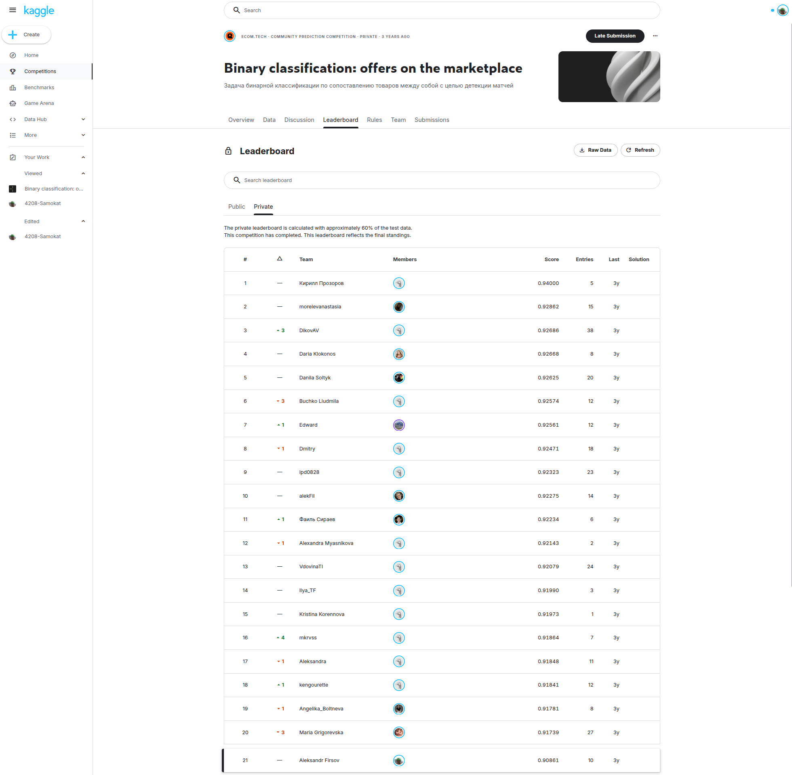
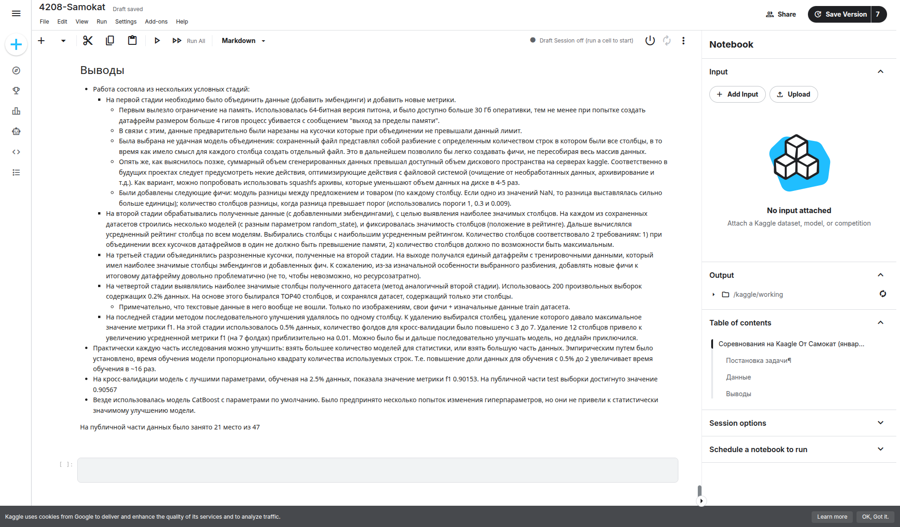

# Закрытое соревнование Kaggle от Самокат: «Binary classification: offers on the marketplace»

В данном разделе представлены артефакты и детальное описание инженерного подхода к решению задачи матчинга товаров в условиях жестких ограничений по вычислительным ресурсам. 

Исходный код решения и датасет не подлежат открытой публикации в соответствии с правилами защиты данных организатора.

## 📊 Доказательства результатов (Proof of Work)
* **Итоговая позиция:** 21 место из 47 участников.
* **Финальная метрика (F1-score):** 
  * **0.90567** — на валидационной выборке при кросс-валидации.
  * **0.90881** — итоговый скор на публичном лидерборде Kaggle (~80% тест-сета).

### 1. Подтверждение позиции на Лидерборде

### 2. Финальные выводы и этапы исследования из рабочего Notebook

---

## 🛠️ Инженерно-аналитический разбор решения

Проект состоял из нескольких усложненных стадий обработки данных, оптимизированных под лимиты памяти (ОЗУ < 30 ГБ) и диска на серверах Kaggle:

1. **Менеджмент памяти и обход OOM (Out of Memory):**
   При добавлении эмбеддингов размер датафрейма превысил 4 ГБ, что вызывало падение по ООМ. Проблема была решена предварительной нарезкой исходных данных на изолированные чанки (куски) по строкам с последующей сборкой, что позволило генерировать фичи без перегрузки ОЗУ.
2. **Генерация признаков (Feature Engineering):**
   Были рассчитаны и добавлены специфические фичи: модуль разницы между предложением и товаром (с заполнением NaN-значений максимальным штрафным расстоянием), а также пороговые детекторы разницы (с порогами 1, 0.3 и 0.009).
3. **Двухэтапный отбор признаков (Feature Selection):**
   * **Этап 1:** Разбиение датасета на чанки для обхода ограничений по памяти. Расчет оптимального количества признаков (\(N\)), при котором полный датасет помещается в ОЗУ. Выделение топ-\(N\) наиболее значимых столбцов внутри каждого чанка и последующая сборка финального датасета только из этих стабильных фич.
   * **Этап 2 (Метод последовательного удаления):** Итеративное сокращение выделенного набора признаков до TOP-7 путем пошагового исключения наименее значимых столбцов. Это позволило дополнительно очистить модель от избыточных данных и повысить итоговую метрику.
4. **Оценка стабильности (Валидация):**
   Использовалась схема кросс-валидации (обучение на 2.5% данных, контроль стабильности фолдов). Эмпирическим путем была установлена квадратичная зависимость времени обучения от объема строк (увеличение выборки с 0.5% до 2% увеличивало время сборки в ~16 раз).
5. **Выбор модели:**
   В качестве базового классификатора использовался **CatBoost** с дефолтными гиперпараметрами, так как тюнинг параметров не давал статистически значимого прироста метрики.
